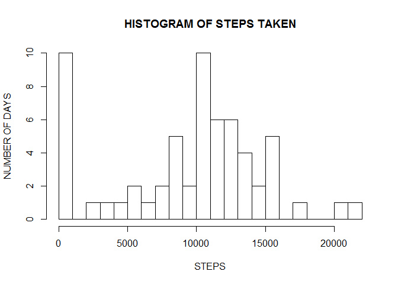
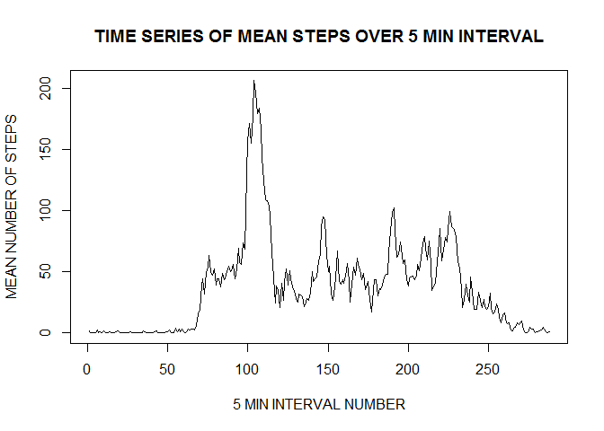
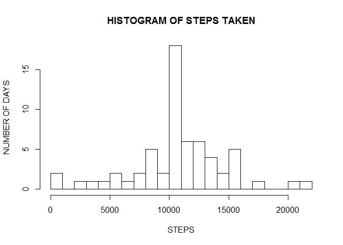
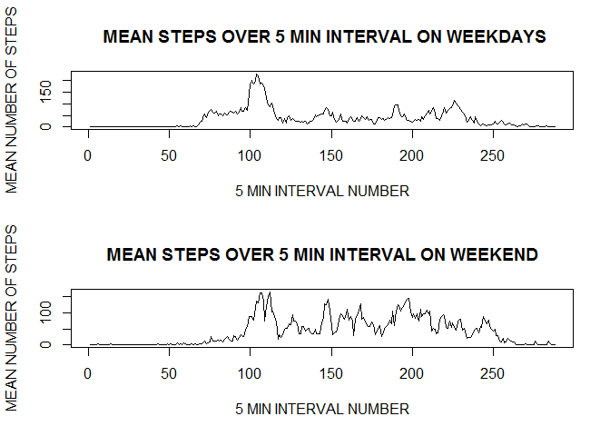

# Analysis of activity monitoring data
Vaishnevi Varadarajan  
###1.Loading and pre-processing the dataset
QUESTION: Show any code that is needed to Load the data (i.e. read.csv())
Process/transform the data (if necessary) into a format suitable for your analysis

ANSWER:
The following code reads the given activity.csv file and pre-processes it to produce appropriate structure for analysis. The date portion of the data is converted into date format. 


```r
unzip("activity.zip")
data <- read.csv("activity.csv")
data$date <- as.Date(data$date)
```
###2. What is mean total number of steps taken per day?
For this part of the assignment, you can ignore the missing values in the dataset.

1.Calculate the total number of steps taken per day. 
2.If you do not understand the difference between a histogram and a barplot, research the difference between them. Make a histogram of the total number of steps taken each day.
3.Calculate and report the mean and median of the total number of steps taken per day.


```r
ans <- sapply(split(data[1],data$date),sum,na.rm=TRUE)
hist(ans,breaks=20, main=paste("HISTOGRAM OF STEPS TAKEN"),xlab="STEPS",ylab="NUMBER OF DAYS")
```

 

```r
mean(ans)
```

```
## [1] 9354.23
```

```r
median(ans)
```

```
## [1] 10395
```

###3.What is the average daily activity pattern?
Make a time series plot (i.e. type = "l") of the 5-minute interval (x-axis) and the average number of steps taken, averaged across all days (y-axis).Which 5-minute interval, on average across all the days in the dataset, contains the maximum number of steps?

```r
mean_steps <- (sapply(split(data$steps,data$interval),mean,na.rm=TRUE))
interval <- (names(mean_steps))
mean_steps1 <- data.frame(mean_steps,interval)
plot(mean_steps1$mean_steps,type="l",main=paste("TIME SERIES OF MEAN STEPS OVER 5 MIN INTERVAL"),xlab="5 MIN INTERVAL NUMBER",ylab="MEAN NUMBER OF STEPS")
```

 

```r
print("The interval containing most number of mean steps is")
```

```
## [1] "The interval containing most number of mean steps is"
```

```r
print(mean_steps1[which.max(mean_steps1$mean_steps),])
```

```
##     mean_steps interval
## 835   206.1698      835
```
###4.Imputing missing values

Note that there are a number of days/intervals where there are missing values (coded as NA). The presence of missing days may introduce bias into some calculations or summaries of the data.

1.Calculate and report the total number of missing values in the dataset (i.e. the total number of rows with NAs)
2. Devise a strategy for filling in all of the missing values in the dataset. The strategy does not need to be sophisticated. For example, you could use the mean/median for that day, or the mean for that 5-minute interval, etc.
3. Create a new dataset that is equal to the original dataset but with the missing data filled in.
4. Make a histogram of the total number of steps taken each day and Calculate and report the mean and median total number of steps taken per day. Do these values differ from the estimates from the first part of the assignment? What is the impact of imputing missing data on the estimates of the total daily number of steps?

```r
#Total number of NAs in step data
sum(is.na(data$steps))
```

```
## [1] 2304
```

```r
#Total number of NAs in interval data
sum(is.na(data$interval))
```

```
## [1] 0
```

```r
#Total number of NAs in date data
sum(is.na(data$date))
```

```
## [1] 0
```

```r
#Total numbr of NAs
sum(is.na(data$steps))+sum(is.na(data$interval))+sum(is.na(data$date))
```

```
## [1] 2304
```
For the purpose of this document, the missing values are imputed with mean for the interval. data1 is the new data frame containing the imputed values. As a check, we see the number of NAs in data1 after  imputing is zero. 


```r
data1 <- data
for (i in 1:length(data1$steps))
{
        if(is.na(data1$steps[i])){
        ind <- which(mean_steps1$interval == data1$interval[i])
        data1$steps[i] <- mean_steps1$mean_steps[ind]
        }
}

#Total number of NAs in data1
sum(is.na(data1$steps))
```

```
## [1] 0
```

```r
ans1 <- sapply(split(data1[1],data$date),sum,na.rm=FALSE)
hist(ans1,breaks=20, main=paste("HISTOGRAM OF STEPS TAKEN"),xlab="STEPS",ylab="NUMBER OF DAYS")
```

 

```r
mean(ans1)
```

```
## [1] 10766.19
```

```r
median(ans1)
```

```
## [1] 10766.19
```

With imputing values to the dataset, overall histogram shape remians the same, except for shift in the number of observations near 0. Also, the mean and the median number of steps per day are now closer to each other.

###5. Are there differences in activity patterns between weekdays and weekends?

For this part the weekdays() function may be of some help here. Use the dataset with the filled-in missing values for this part.

1. Create a new factor variable in the dataset with two levels - "weekday" and "weekend" indicating whether a given date is a weekday or weekend day.
2. Make a panel plot containing a time series plot (i.e. type = "l") of the 5-minute interval (x-axis) and the average number of steps taken, averaged across all weekday days or weekend days (y-axis). 


```r
library(timeDate)
```

```
## Warning: package 'timeDate' was built under R version 3.2.3
```

```r
weekday_end <- isWeekday(data1$date)
data1 <- cbind(data1,weekday=weekday_end)
data2 <- split(data1,data1$weekday)

data_weekend <- data2[[1]]
data_weekday <- data2[[2]]
mean_steps_weekday <- (sapply(split(data_weekday$steps,data_weekday$interval),mean))
interval <- (names(mean_steps_weekday))
mean_steps1_weekday <- data.frame(mean_steps_weekday,interval)
mean_steps_weekend <- (sapply(split(data_weekend$steps,data_weekend$interval),mean))
interval <- (names(mean_steps_weekend))
mean_steps1_weekend <- data.frame(mean_steps_weekend,interval)
par(mfrow=c(2,1)) 
plot(mean_steps1_weekday$mean_steps_weekday,type="l",main=paste(" MEAN STEPS OVER 5 MIN INTERVAL ON WEEKDAYS"), xlab="5 MIN INTERVAL NUMBER",ylab="MEAN NUMBER OF STEPS")
plot(mean_steps1_weekend$mean_steps,type="l",main=paste("MEAN STEPS OVER 5 MIN INTERVAL ON WEEKEND"),xlab="5 MIN INTERVAL NUMBER",ylab="MEAN NUMBER OF STEPS")
```

 

```r
#Mean steps during weekday
sum(mean_steps1_weekday$mean_steps_weekday)
```

```
## [1] 10255.85
```

```r
#Mean steps during weekend
sum(mean_steps1_weekend$mean_steps_weekend)
```

```
## [1] 12201.52
```

It can be seen that on an average, the subject has walked more steps over the weekend than over weekdays. 
